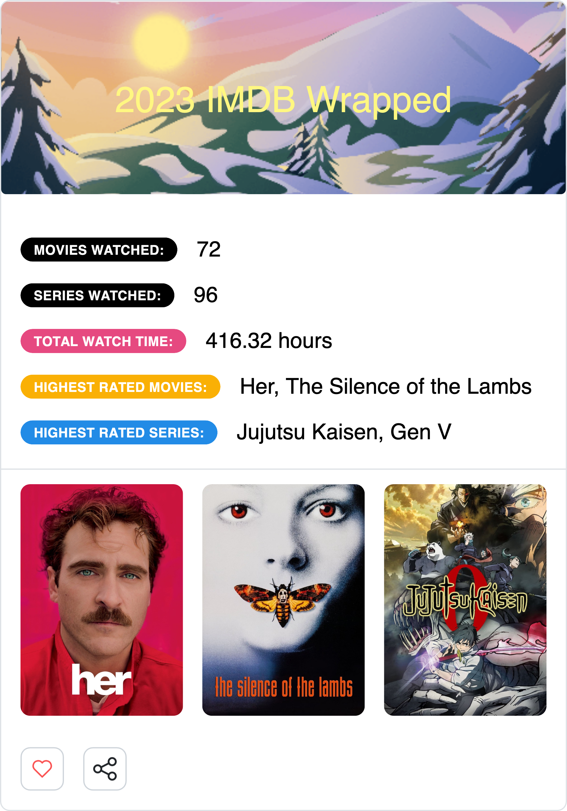

# IMDB Unwrapped

This is a web application that allows users to generate a report of their watched movies and shows from IMDB.

## Getting Started

These instructions will get you a copy of the project up and running on your local machine for development and testing purposes.

### Prerequisites

- Node.js
- NPM

### Installation

- Clone this repository
```bash
git clone https://github.com/your-github-username/IMDB-Unwrapped.git
```
1. Navigate into the project directory
cd IMDB-Unwrapped
2. Install the dependencies
```
npm install
```

3. Start the development server

```bash
npm run dev
```
4. Open your browser and visit http://localhost:3000

## Usage

1. Select a CSV file of your watched movies and shows from IMDB
2. Click on Generate Report to get your report

## Demo



## Built With

- [Next.js](https://nextjs.org/)
- [Mantine](https://mantine.dev/)
- [JustWatch GraphQL API](https://api.justwatch.com/)

